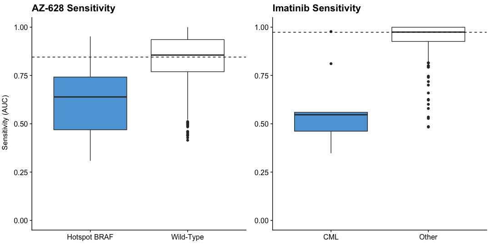
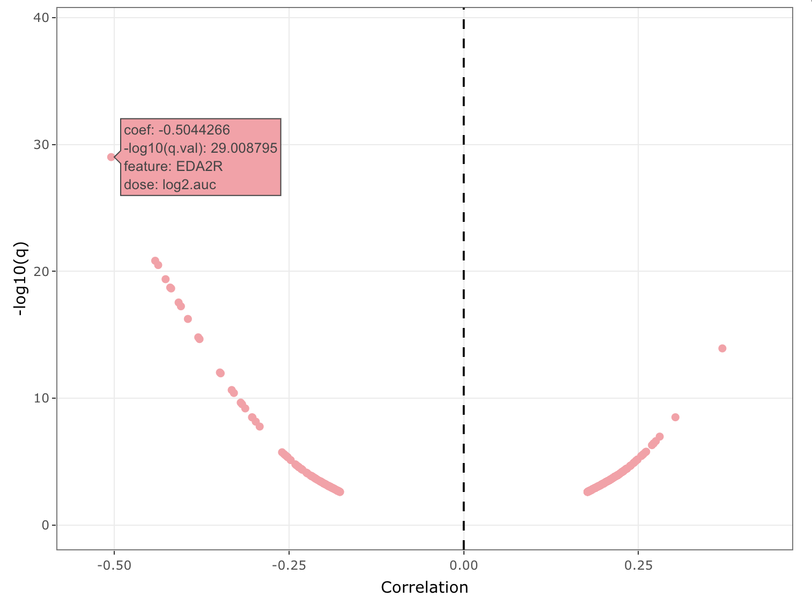
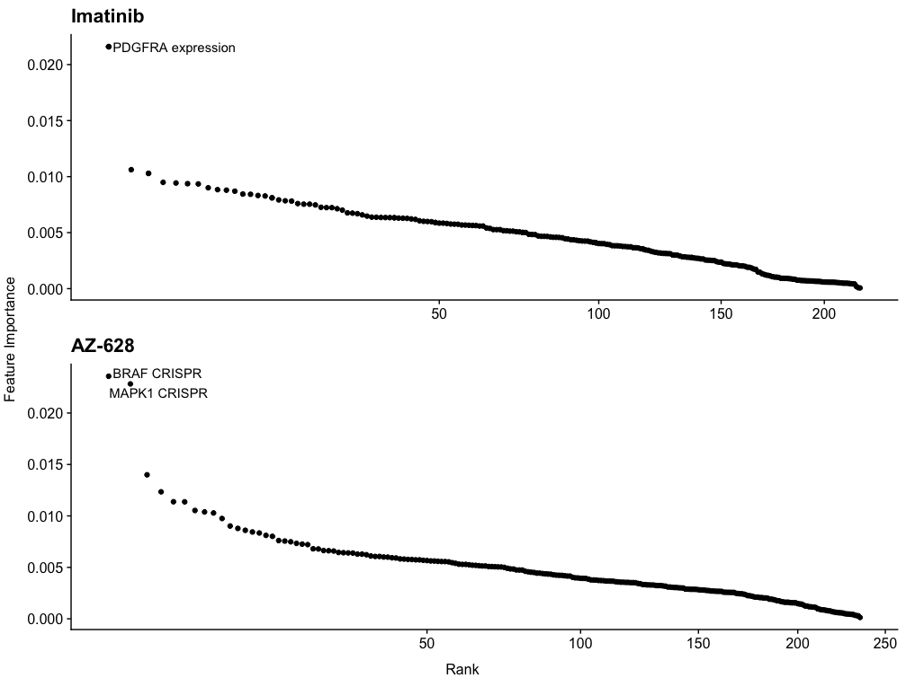

# PRISM Biomarker Analysis Overview

There are three primary analyses performed in the standard MTS pipeline:

1. $t$-tests of differences between discrete features (lineage and mutation).
2. Correlations between sensitivity and continuous features
3. Multivariate models predicting sensitivity based on multi-omics feature sets.

## Discrete analysis ($t$ tests)

Our discrete analyses test the relationship between discrete features, such as mutation and lineage, and sensitivity to a compound. These features are called discrete because they can only take on a finite number of values (either a cell line has a mutation or does not). To determine these discrete relationships we do a $t$ test comparing cell lines that have a certain feature (e.g. a BRAF mutation) and those that do not.

This generates an effect size, measuring the difference in the mean senstivity between the two groups, and a $p$ value, measuring the significance of that difference. We then use the [Benjamini Hochberg  algorithm](https://www.jstor.org/stable/2346101?seq=1) to correct the $p$ values to $q$ values, to account for false discovery rate (FDR). For a vector $p$ the corresponding $q$ values  are:

$$q_i = \frac{p_i \cdot |p|}{\textrm{rank}(p_i)}$$

This algorithm is also used to generate $q$ values in continuous analyses.

## Continuous analysis

Our continuous analyses test the relationship between continuous features, such as gene expression, and sensitivity to a compound.

### Correlations

To determine these relationships we calculate the Pearson correlation between a feature and sensitivity. We test how significantly different these correlations are from $0$, to get a $p$ value, by generating a $t$-distribution with $n -2$  degrees of freedom. We then generate associated $q$ values with the algorithm above.

Shown above is the correlations between Nutlin-3 area under the curve (AUC) and gene expression. Each point represents a gene. The highlighted point is one of the biomarkers for Nutlin-3a and shows as the top correlated. The negative correlation indicates that increased gene expression tends to coincide with decreased AUC (meaning more sensitivity).

### Posterior means

In addition to Pearson correlations, we also report the posterior mean of the effect size of a gene, calculated with adaptive shrinkage (using the [`ashr` package](https://cran.r-project.org/web/packages/ashr/vignettes/adaptive_shrinkage.html)). This is a measure of the expected change in $y$ (sensitivity) for a unit of change in $x$ (gene expression or some other feature). Unlike correlations, these values can be well above $1$ or below $-1$. There are also $q$ values associated with these metrics which are calculated in the same way as correlation $q$ values.

## Multivariate models

Our multivariate models use a combination of -omics datasets to generate predictions about compound sensitivity. In particular we use a cross-validated random forest model to predict sensitivity based on -omics features. We then compare the predictions of our model with actual results to determine model accuracy, reported as $R^2$ and Pearson Score:

$$R^2 = 1- (\frac{(\hat{y} -  y)^2}{\textrm{var(y)}})$$
$$PS  = \textrm{cor}(y, \hat{y})$$

Where $y$ is the vector of observed sensitivities and $\hat{y}$ is the vector of predictions by the model.

We can also extract the estimated importance of each feature of the model in generated the predictions in order to pick out potential biomarkers. We use "impurity" importances, which are a measure of the improvement of splitting criteria for each tree (Gini gain). Effectively, the feature importances tell us how much better the model performs with the inclusion of a give feature. Features that are important in well-performing models are said to be of interest.

Shown above are the importances of the top 250 features in models predicting imatinib and AZ-628 sensitivity. In both cases, targets of the compounds show up as the most important. It is important to not that feature importance is a directionless measure, so other analyses must be compared to determine whether a feature is associated with increased or decreased sensitivity.
